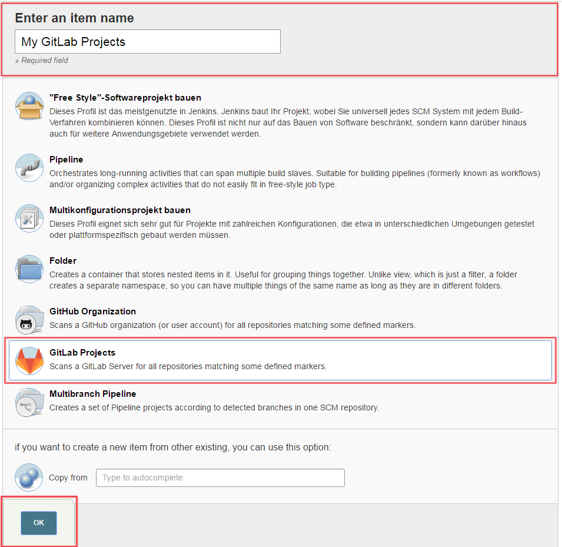
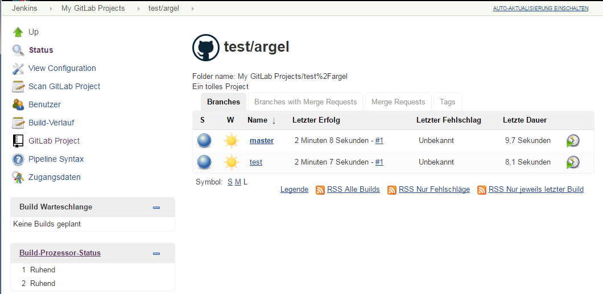
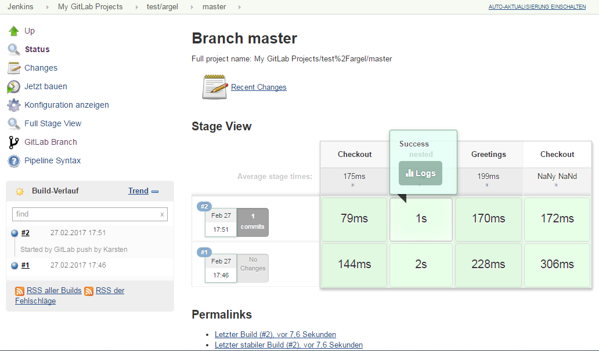
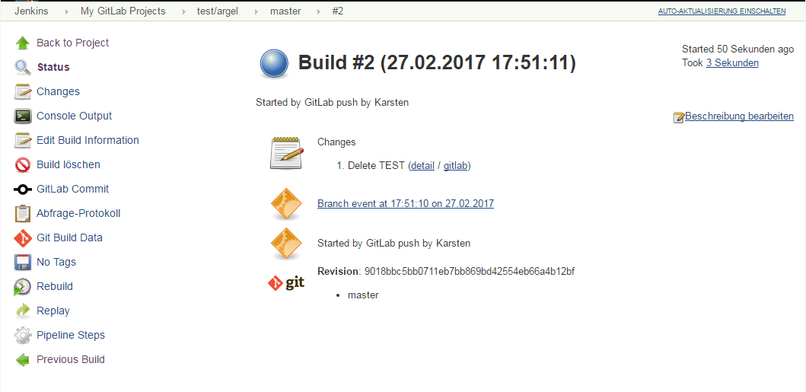

# Multibranch projects and organization folders from GitLab 

##Introduction
The GitLab Branch Source Plugin allows you to create a new project based on the repository structure based on your GitLab
 projects. It is heavily inspired by the [GitHub Branch Source Plugin](https://wiki.jenkins-ci.org/display/JENKINS/GitHub+Branch+Source+Plugin),
  builds upon the [GitLab Plugin](https://wiki.jenkins-ci.org/display/JENKINS/GitLab+Plugin) and uses the
 [Gitlab Java API Wrapper](https://github.com/timols/java-gitlab-api) for communication with GitLab.

The GitLab Branch Source Plugin scans your GitLab server for projects according to criteria you can specify. 
The only restriction is that your projects must contain a `Jenkinsfile` with the definition of the pipeline used to
build the project. You can have different Pipeline scripts defined in project branches, or add and remove `Jenkinsfile`s 
depending on your use cases. After a project is imported, Jenkins immediately runs a job.
Removing a Pipeline script from a branch or from the entire project, removes the item from the view. 
You can restrict imports on the GitLab Branch Source configuration page. Restrictions include regular expressions for 
origin branches, merge requests from the original projects or it's forks etc.

Like the [GitHub Branch Source Plugin](https://wiki.jenkins-ci.org/display/JENKINS/GitHub+Branch+Source+Plugin) this plugin
creates each repository as a folder containing each branch with a Jenkinsfile in the top level directory as a different 
job.

When the proper webhooks are configured, the GitLab Branch Source Plugins automatically detects new projects, branches and
merge requests, adds new jobs accordingly and builds them. If Jenkins (or rather the user configured to communicate with
GitLab) is allowed to do so, it will setup these webhooks automatically for you.

When Jenkins is allowed to do so build results will be reported
back to GitLab. You can choose wheter only the build result (success/failure) get reported or if Jenkins reports every 
stage defined in your pipeline.

## GitLab merge requests
The GitLab Branch Source plugin allows the project to import merge requests originating either from branches in the original
project or from forked projects as long as they also contain a `Jenkinsfile` with pipeline script. The following features
are included:

- merge requests are imported as separate jobs and can be either build from their current head or merged with the base branch
- origin branches with merge requests can be configured to not be built automatically
- you can configure whether merge requests will be built on every change or only when GitLab determines that they can be merged into the base branch
- when Jenkins is allowed to do so you can configure the plugin so that it automatically accepts merge requests on when
 the build succeeds and optionally remove the merge requests's source branch.

## Installation
This plugin is still under development. Thus you cannot install it via the Jenkins Update manager yet. Simply download the
[latest release](https://github.com/Argelbargel/gitlab-branch-source-plugin/releases) into the plugins directory of your
Jenkins. I'm not sure if the dependencies get installed automatically. If that is not the case, make sure to install these
dependencies:
- [branch-api 2.0.7](https://wiki.jenkins-ci.org/display/JENKINS/Branch+API+Plugin)
- [cloudbees-folder 5.18](https://wiki.jenkins-ci.org/display/JENKINS/CloudBees+Folders+Plugin)
- [credentials 2.1.2](https://wiki.jenkins-ci.org/display/JENKINS/Credentials+Plugin)
- [git 3.0.5](https://wiki.jenkins-ci.org/display/JENKINS/Git+Plugin)
- [git-client 2.2.1](https://wiki.jenkins-ci.org/display/JENKINS/Git+Client+Plugin)
- [gitlab-plugin 1.4.5](https://wiki.jenkins-ci.org/display/JENKINS/Gitlab+Plugin)
- [scm-api 2.0.7](https://wiki.jenkins-ci.org/display/JENKINS/SCM+API+Plugin)
- [workflow-api 2.11](https://wiki.jenkins-ci.org/display/JENKINS/Pipeline+API+Plugin) 
- [workflow-cps 2.28](https://wiki.jenkins-ci.org/display/JENKINS/Pipeline+Groovy+Plugin) 
- [workflow-job 2.10](https://wiki.jenkins-ci.org/display/JENKINS/Pipeline+Job+Plugin) 
- [workflow-multibranch 2.12](https://wiki.jenkins-ci.org/display/JENKINS/Pipeline+Multibranch+Plugin) 

## Creating a project
This plugin uses the [GitLab Plugin](https://wiki.jenkins-ci.org/display/JENKINS/GitLab+Plugin)
for communication with GitLab. Thus before creating a GitLab Branch Source you'll have to setup a appropriate [GitLab
Connection](https://github.com/jenkinsci/gitlab-plugin#configuring-access-to-gitlab). The user used to communicate with
 GitLab must have at least the developer role. To automatically register webhooks etc. the user must currently have 
 administrator rights (to register the required system-hook). IT IS NOT RECOMMENDED TO USE THIS WHEN COMMUNICATING WITH
 YOUR GITLAB-SERVER VIA A PUBLIC NETWORK - REGISTER THE WEBHOOKS MANUALLY IN THIS CASE (see the configuration of the 
 projects for the required webhook-urls).
 
Having created a working GitLab connection, simply create a new branch source via `New Item > GitLab Projects`.
 
 
In the Projects section, complete the section for "GitLab Projects". Here you can also specify credentials which should
 be used to checkout your projects if anonymous read-access to your projects is disabled.

Save, and wait for the "Project Scan" to run. Job progress is displayed to the left hand side.

To see the imported projects click on "Status".

To see the imported branches/merge requests/tags and their build status, drill down by clicking on the appropriate links

### Project-Details

### Details of Branches

### Build-Details

